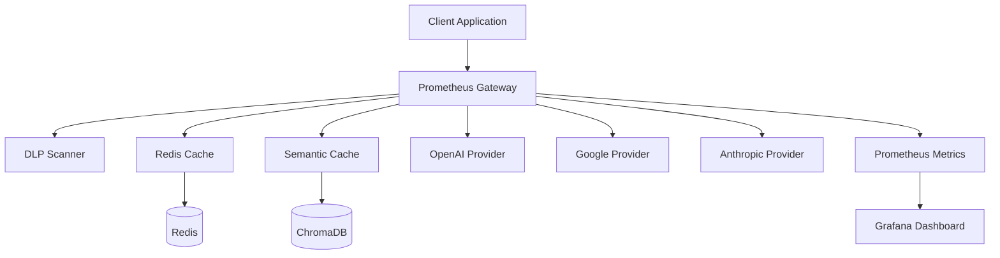

# Prometheus Gateway

A high-performance, multi-provider LLM gateway with advanced caching, monitoring, and security features.

## 🚀 Features

### Multi-Provider Support
- **OpenAI GPT** - GPT-4o, GPT-3.5-turbo, and more
- **Google Gemini** - Gemini 2.5 Flash, Gemini 2.5 Pro
- **Anthropic Claude** - Claude Sonnet, Claude Opus
- **Extensible Architecture** - Easy to add new providers

### Intelligent Routing
- **Configuration-Driven** - YAML-based provider configuration
- **Model-to-Provider Mapping** - Automatic routing based on model names
- **Failover Support** - Automatic fallback to alternative providers

### Two-Level Caching System
- **Exact Cache** - Redis-based caching for identical requests
- **Semantic Cache** - ChromaDB vector search for similar queries
- **Configurable TTL** - Customizable cache expiration times
- **Cache Analytics** - Monitor cache hit rates and performance

### Security & Privacy
- **Data Loss Prevention (DLP)** - Automatic PII detection and anonymization
- **API Key Management** - Secure key generation and validation
- **Rate Limiting** - Per-key request throttling
- **Input Sanitization** - Comprehensive request validation

### Monitoring & Observability
- **Prometheus Metrics** - Custom metrics for all operations
- **Grafana Dashboards** - Pre-built monitoring dashboards
- **Structured Logging** - JSON-formatted logs with correlation IDs
- **Health Checks** - Comprehensive service health endpoints

## 🏗️ Architecture



## 📊 Performance

- **Sub-50ms Latency** - For cached responses
- **99.9% Uptime** - Highly available with proper deployment
- **Horizontal Scaling** - Stateless design for easy scaling
- **Memory Efficient** - Optimized for high-throughput scenarios

## 🔒 Security

- **Zero-Trust Architecture** - All requests require valid API keys
- **PII Protection** - Automatic detection and anonymization
- **Audit Logging** - Complete request/response audit trail
- **Rate Limiting** - Protection against abuse and DoS attacks

## 📈 Monitoring

Real-time monitoring with:
- Request latency histograms
- Token usage tracking
- Error rate monitoring
- Cache performance metrics
- Provider health status

## 🚀 Quick Start

```bash
# Clone the repository
git clone https://github.com/ozanunal0/prometheus-gateway.git
cd prometheus-gateway

# Start with Docker Compose
docker-compose up -d

# Or run locally
pip install -r requirements.txt
python -m spacy download en_core_web_lg
uvicorn app.main:app --reload
```

## 📚 Documentation

- [Quick Start Guide](getting-started/quickstart.md)
- [Configuration Reference](configuration/overview.md)
- [API Documentation](api/endpoints.md)
- [Testing Guide](development/testing.md)

## 🤝 Contributing

We welcome contributions! Please see our [Testing Guide](development/testing.md) for development information.

## 📄 License

This project is licensed under the MIT License - see the [LICENSE](LICENSE) file for details.

## 🆘 Support

- 📖 [Documentation](https://ozanunal0.github.io/prometheus-gateway)
- 🐛 [Issue Tracker](https://github.com/ozanunal0/prometheus-gateway/issues)
- 💬 [Discussions](https://github.com/ozanunal0/prometheus-gateway/discussions)